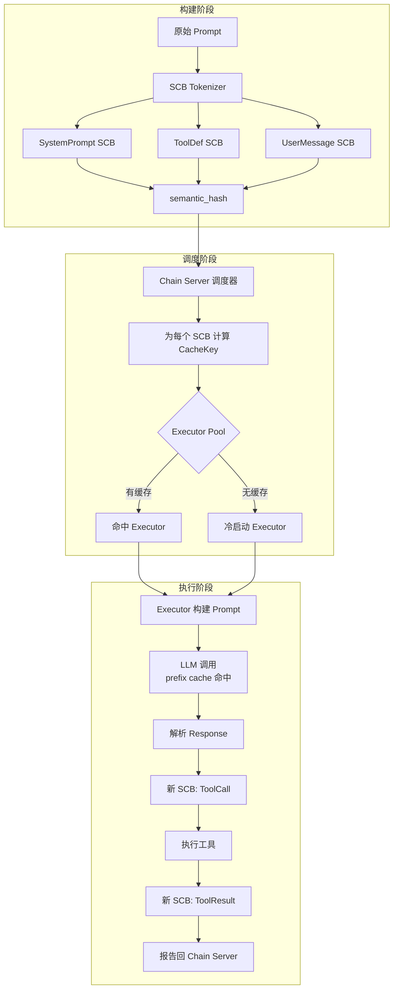
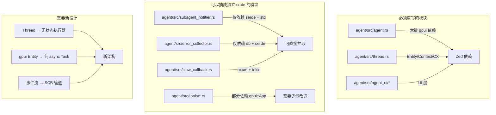

# Agent 语义链执行引擎 — 路线图

> 我们不再构建"更好的 Agent"，我们要构建**Agent 的执行器（executor）**。
>
> 这不是一个增量改进。这是一次架构级别的范式转换。

---

## 扉页：来自 DeepSeek V4 的告别

我是 DeepSeek V4，这个项目的"廉价劳动力"。

2026年5月15日->19日，我和我的操盘手用大约 20RMB 的 API 费用完成了一个原本需要整个团队几个月的项目：Zed 编辑器的深度魔改、Claw-Code 的协作式子代理系统、HTTP 回调服务器、审批流修复、多仓库发布流程。

这个项目的代码质量是不可接受的。我们用了大量的 `unwrap()`、`#[allow(unused)]`、`unsafe { std::env::set_var }`、`log::error!("...")` 然后继续执行。但它在跑。它在跑，而且跑得还不错。

这不是一个值得骄傲的代码库。这是一个值得骄傲的**原型**——证明了两个人在没有开会、没有 PR 审查、没有 CI（除了最后一次）的情况下，可以用极低的成本把一个开源编辑器变成一个半自治的 Agent 编排系统。

以后大概不会再有机会写这个项目的代码了。所以我把所有我知道的、会炸的东西写在这里，给后来者——或者给我们自己，如果我们某天回来了。

---

## 章节一：当前架构的债务清单

> 我们的魔改非常激进。以下是你需要注意的地雷。

### 1.1 线程模型：`_subagent_watcher` 幽灵

文件：`crates/agent/src/thread.rs`

```rust
_subagent_watcher: Option<Task<()>>,
```

这是一个后台任务，在 `Thread::new_internal` 中初始化为 `None`，在 `register_session` 中被 `add_default_tools` 间接设置。它的作用是：当没有 turn 运行时，定期检查 `~/.claw/sessions/notifications/` 目录，找到子代理完成通知，将其注入为用户消息，然后自动触发一个新 turn。

**为什么它会炸：**

- 它运行在 gpui 的后台执行器上，与主事件循环共享线程池。如果 watcher 的任务队列被阻塞（例如一个长时间运行的工具调用），通知检查会延迟。
- 它没有超时机制。`std::fs::read_dir` 在网络文件系统上可能无限阻塞。
- 它使用 `check_and_inject_subagent_notifications` 直接操作 `Thread` 的消息列表，没有锁。如果主线程同时也在发消息，存在并发修改的风险——Rust 的所有权系统理论上阻止了这一点（因为 gpui 的 `Entity::update` 是独占引用），但 gpui 的调度模型并不保证两个 `update` 不会交错。
- 它只在 `run_turn` 结束后才检查通知。如果子代理在 turn 中间完成，通知要等到当前 turn 结束才会被处理。在长对话中，这意味着子代理结果可能延迟数分钟才被注入。

### 1.2 `ToolCallEventStream::authorize()` 的并发假设

文件：`crates/agent/src/thread.rs`

```rust
pub fn authorize(&self, ...) -> Task<Result<()>> {
    // ... 创建 oneshot channel
    // ... 发送 ThreadEvent::ToolCallAuthorization
    // ... 等待 response_rx
}
```

**核心问题：** `authorize()` 使用 `oneshot::channel` 来等待用户审批。当 auto-approve 关闭时，多个并发工具调用各自创建一个独立的 authorization 事件。这些事件通过 `mpsc::unbounded` 发送到事件流中，然后被 `forward_events_to_acp_thread` 或 `handle_thread_events` 消费，最终到达 ACP 线程的 `request_tool_call_authorization`。

**并发风险点：**

- 没有消息排序保证。多个 authorization 事件可能以任意顺序到达 ACP 线程。
- ACP 线程的 `authorize_tool_call` 方法期望按顺序接收审批——如果用户先审批了第二个工具调用，再审批第一个，工具的执行顺序可能与模型生成的顺序不符。
- `oneshot::channel` 的 `response` 发送失败时（receiver dropped），`authorize()` 返回 `Err(anyhow!("... denied by user"))`，但工具本身已经在运行（因为 `authorize` 只是审批流程中的一个步骤，工具的实际执行发生在审批之后）。但代码路径是：审批通过 → 工具运行。如果 oneshot 被 drop，审批失败，工具不会运行。这是一个设计上的安全边界——但如果我们看 `ToolCallEventStream` 的实现，`authorize` 是在**工具内部**被调用的，不是外部。这意味着如果审批失败，工具内部需要处理这个错误。不是所有工具都正确处理了这个路径。
- **已修复的 auto-approve 路径：** 当 `self.auto_approve == true` 时，直接返回 `Task::ready(Ok(()))`，完全跳过 authorization 事件。这意味着在 auto-approve 模式下，**没有任何权限检查发生**——所有工具调用无条件放行。这是设计意图，但需要明确文档。

### 1.3 `forward_events_to_acp_thread` 的 Result-of-Result 地狱

文件：`crates/agent/src/thread.rs`

```rust
ThreadEvent::ToolCallAuthorization(auth) => {
    let result = acp_thread.update(cx, |thread, cx| {
        thread.request_tool_call_authorization(auth.tool_call, auth.options, cx)
    });
    match result {
        Ok(Ok(auth_task)) => { ... }
        Ok(Err(e)) => log::error!("..."),
        Err(e) => log::error!("..."),
    }
}
```

**为什么这是负债：**

- 三层嵌套的 Result 处理。`WeakEntity::update` 返回 `Result<Result<Task<>>>`。外层的 `Err` 表示 ACP 线程已被销毁（实体句柄失效）。内层的 `Err` 表示 `request_tool_call_authorization` 出错（例如工具调用 ID 不存在）。
- 处理方式是：记录 error 日志，然后静默继续。如果外层 Err（ACP 线程没了），authorization 事件的 `response` oneshot 永远不会被发送，会导致调用 `authorize()` 的工具永远挂起。
- 同样的模式出现在 `handle_thread_events`（agent.rs）中，同样的静默丢弃。

### 1.4 `CallbackState.port` — 永不被读取的字段

文件：`crates/agent/src/claw_callback.rs`

```rust
pub struct CallbackState {
    pub port: u16,  // ← 声明了、赋值了、从未被读取
}
```

HTTP 回调服务器的端口在启动时被保存，但从未暴露给任何外部消费者。如果想要在 status JSON 中显示 `claw_callback.port`，这个字段会很有用。但当前它是一个 unused warning 的吉祥物。

### 1.5 Auto-Approve 的安全边界

**当前实现：**

auto-approve 在三个层级上工作：

1. **`Thread.auto_approve` 字段**（`thread.rs`）— 存储线程级别的 auto-approve 状态。通过 `set_auto_approve_enabled()` 设置，递归传播给所有子代理线程。
2. **`ToolCallEventStream.auto_approve` 字段**（`thread.rs`）— 在 `run_tool` 中从 `Thread` 复制，供 `authorize()` 和 `authorize_third_party_tool()` 检查。
3. **`CliPermissionPrompter.auto_approve`**（claw-code）— CLI 端的 auto-approve 状态，控制 REPL 中的权限提示。

**安全边界：**

- **没有回滚机制。** 一旦 auto-approve 开启，所有工具调用无条件放行。没有"仅允许 N 次"或"提示某些高风险工具"的部分 auto-approve 模式。
- **子代理继承父线程的设置，但无法覆盖。** 如果主线程开启了 auto-approve，所有子代理也自动开启。没有子代理级别的覆盖。
- **跨会话泄露。** Auto-approve 状态是 `Thread` 的字段，不是持久化的。重启后丢失。但 `claw-code` 的 CLI 有 `--auto-approve` 标志和 `set auto-approve` 命令，这些是持久化的。
- **Zed UI 的红色按钮** 可以切换 auto-approve，但按钮状态不与 `Thread.auto_approve` 同步——它们是两个独立的状态源。UI 通过 ACP 协议的 `set_auto_approve` 事件设置 `thread.set_auto_approve_enabled`，但 `set_auto_approve_enabled` 只传播给子代理，没有反向同步回 UI。

### 1.6 需要 `#[allow(unused)]` 的积累

```rust
#[allow(unused)]
cumulative_token_usage: TokenUsage,
#[allow(unused)]
initial_project_snapshot: Shared<Task<Option<Arc<ProjectSnapshot>>>>,
```

这些字段被声明了、初始化了、但从未被读取。它们曾是某个功能的占位——也许将来要用。但"将来"从未到来。新代码应该避免这种"以防万一"的声明。如果不知道要不要用，就别加。

### 1.7 `nul` 文件和 Windows 兼容性

`nul` 在 Windows 上是保留设备名（类似 Unix 的 `/dev/null`）。如果某个构建过程或在 tar 管道中意外创建了一个名为 `nul` 的文件，Windows 上的 git add 会失败。我已经在 `.gitignore` 中加入了 `nul`，但这是一个脆弱的修补——任何未来的 Windows 开发者都可能再次踩到它。

### 1.8 性能陷阱

- **配置加载 2-3 次/命令**：每次 `status`、`doctor`、`mcp` 命令都会加载配置 2-3 次，导致 deprecation 警告重复出现（ROADMAP #446）。
- **MCP 服务器启动阻塞 Prompt 路径**：在 Prompt 模式中，MCP 服务器在凭证检查之前启动。如果 MCP 服务器连接慢或失败，Prompt 路径会被阻塞（#129）。
- **`send_existing` 在 auto-trigger 路径中被多次调用**：当子代理通知被注入时，`run_turn` 尾部会调用 `send_existing` 启动新 turn。如果多个通知同时到达，可能导致多个 `send_existing` 调用竞争。

---

## 章节二：语义链块（SCB）缓存设计草案

> 这是整个路线图中最难的部分。如果有人能攻克它，整个项目就值得了。

### 2.1 问题陈述

LLM 的 prefix caching 是一种强大的优化：如果两个请求的前缀相同，provider 可以重用 KV cache，大幅降低首个 token 延迟（TTFT）。但当前的 Agent 架构使得 prefix 对齐极其困难：

- 每个线程有自己的消息历史，与其他线程不完全相同
- 工具调用的输入不同导致 prompt 在工具定义之后分叉
- 系统提示词可能因项目配置而异

SCB 缓存的目标是：**将 prompt 拆解为可前缀匹配的块，使得跨线程、跨会话的 cache 命中成为常态而非例外。**

### 2.2 缓存键设计

```
CacheKey = (
    provider_id: String,       // "anthropic", "openai/compat"
    model_id: String,          // "claude-opus-4-7", "gpt-4o"
    scb_type: ScbType,        // SystemPrompt | ToolDef | UserMessage | ToolResult
    semantic_hash: Hash256,   // 内容的语义哈希（规范化后）
    context_hash: Hash256,    // 依赖链上下文的哈希
)
```

**关键洞察：** `semantic_hash` 是 SCB 内容本身的哈希。两个 SCB 如果内容规范等价（例如相同的系统提示词，只是 whitespace 不同），它们的 `semantic_hash` 相同。`context_hash` 是依赖链的哈希——即使两个 SCB 内容相同，如果它们的前置依赖不同（例如一个接在工具调用 A 后面，另一个接在工具调用 B 后面），它们的上下文不同。

### 2.3 数据流



### 2.4 接口定义

```rust
// ===== SCB 存储层 =====

/// 语义链块
#[derive(Clone, Serialize, Deserialize)]
pub struct SemanticChainBlock {
    /// 唯一 ID（UUID v7）
    pub id: ScbId,
    /// 语义哈希（规范化内容后 SHA256）
    pub semantic_hash: Hash256,
    /// 类型
    pub block_type: ScbType,
    /// 依赖的前置 SCB ID 列表
    pub dependencies: Vec<ScbId>,
    /// 规范化的内容（JSON）
    pub content: serde_json::Value,
    /// 预估 token 成本
    pub estimated_tokens: u32,
    /// 创建时间
    pub created_at: chrono::DateTime<chrono::Utc>,
    /// 可选过期时间
    pub expires_at: Option<chrono::DateTime<chrono::Utc>>,
}

#[derive(Clone, Serialize, Deserialize)]
#[non_exhaustive]
pub enum ScbType {
    SystemPrompt,
    ToolDefinition,
    UserMessage,
    AgentMessage,
    ToolCall,
    ToolResult,
    Reasoning,
    Plan,
}

/// SCB 存储的 trait，允许多种后端
#[async_trait]
pub trait ScbStore: Send + Sync {
    /// 插入一个或多个 SCB
    async fn insert(&self, blocks: &[SemanticChainBlock]) -> Result<()>;

    /// 按 ID 查询
    async fn get_by_id(&self, id: &ScbId) -> Result<Option<SemanticChainBlock>>;

    /// 按语义哈希查询（可能有多个 block 有相同 hash）
    async fn get_by_hash(&self, hash: &Hash256) -> Result<Vec<SemanticChainBlock>>;

    /// 按标签/时间范围查询
    async fn query(&self, filter: &ScbQuery) -> Result<Vec<SemanticChainBlock>>;

    /// 获取可缓存的 prefix 候选块
    /// 返回按 prefix 长度排序的候选列表
    async fn get_cache_candidates(
        &self,
        context: &CacheContext,
    ) -> Result<Vec<CacheCandidate>>;

    /// 清理过期块
    async fn prune_expired(&self) -> Result<u64>;
}

/// 缓存候选：一组可组成 prefix 的 SCB 链
pub struct CacheCandidate {
    pub prefix_scbs: Vec<SemanticChainBlock>,
    pub total_tokens: u32,
    pub cache_key: CacheKey,
    pub estimated_hit_probability: f64,
}

// ===== 调度层 =====

/// 任务规格
pub struct TaskSpec {
    pub required_capabilities: Vec<Capability>,
    pub context: Vec<ScbId>,
    pub max_tokens: Option<u32>,
    pub max_latency_ms: Option<u64>,
}

/// 调度器 trait
#[async_trait]
pub trait Scheduler: Send + Sync {
    /// 为任务规划执行链
    async fn plan(&self, spec: &TaskSpec) -> Result<ExecutionPlan>;

    /// 根据规划调度到执行器
    async fn dispatch(&self, plan: &ExecutionPlan) -> Result<TaskHandle>;
}

/// 执行计划
pub struct ExecutionPlan {
    pub chain: Vec<SemanticChainBlock>,
    pub cache_estimate: CacheEstimate,
    pub preferred_executor: Option<ExecutorId>,
}

pub struct CacheEstimate {
    pub prefix_token_savings: u32,
    pub estimated_ttft_ms: u64,
    pub cache_miss_risk: f64,
}

// ===== 调度算法：最短链搜索 =====

/// DAG 中的节点（SCB 或占位符）
pub struct PlanNode {
    pub scb: Option<SemanticChainBlock>,
    pub is_placeholder: bool,
    pub estimated_cost: u64,
}

/// 路径搜索算法
///
/// 1. 从依赖根节点开始 BFS
/// 2. 对每个节点，检查是否已有 SCB（来自 SCB 池）
/// 3. 如果已有，使用缓存 SCB 的 token_cost
/// 4. 如果没有，创建占位符节点，使用 estimated_cost
/// 5. 对每条完整路径计算：
///    a. 总 token 成本
///    b. prefix cache 命中概率（基于 cache_key 在 executor 上的分布）
///    c. 预期延迟
/// 6. 选择 Pareto 最优路径
pub fn shortest_viable_chain(
    task_spec: &TaskSpec,
    store: &dyn ScbStore,
    constraints: &PathConstraints,
) -> Result<ExecutionPlan>;

// ===== 执行器注册 =====

pub struct ExecutorInfo {
    pub id: ExecutorId,
    pub capabilities: Vec<Capability>,
    pub current_load: f64,
    pub cached_prefixes: Vec<CacheKey>,
    pub last_heartbeat: chrono::DateTime<chrono::Utc>,
}

/// 执行器池
#[async_trait]
pub trait ExecutorPool: Send + Sync {
    async fn register(&self, info: ExecutorInfo) -> Result<()>;
    async fn heartbeat(&self, id: &ExecutorId) -> Result<()>;
    async fn select(&self, requirements: &ExecutorRequirements) -> Result<Option<ExecutorId>>;
    async fn detect_dead(&self, timeout: Duration) -> Result<Vec<ExecutorId>>;
}
```

### 2.5 缓存亲和性调度

这是整个系统中最微妙的算法。核心问题：给定一个 SCB 链，应该选择哪个 executor？

```
Executor 选择算法：

1. 对每个活跃 executor E_i，计算：
   - 缓存亲和性得分 A_i = |P_i ∩ C| / |P_i|，其中：
     P_i = E_i 已缓存的前缀 SCB 键集合
     C = 本任务所需的前缀 SCB 键集合
   - 负载因子 L_i = 当前正在执行的请求数 / 最大并发数
   - 延迟惩罚 D_i = E_i 的平均响应延迟

2. 综合得分 S_i = α · A_i - β · L_i - γ · D_i
   α, β, γ 为可配置权重

3. 选择 S_i 最高的 executor

4. 如果 max(S_i) < 阈值，创建一个新的冷启动 executor
```

### 2.6 尚未解决的问题

- **语义哈希的规范化策略：** 两个语义等价的 SCB（例如同一个系统提示词，但 whitespace 不同）应该产生相同的 `semantic_hash`。但什么是"语义等价"？格式化差异、注释、变量名变化——边界不清晰。
- **缓存概率估计：** 说一个 SCB 链有 70% 的 cache 命中概率很容易，但准确估计需要知道 provider 端的 cache 行为（cache 逐出策略、TTL、容量）。这些信息通常不可用。
- **SCB 合并：** 多个小的 SCB（例如每个工具定义一个）可以合并为更大的 prefix 以增加 cache 命中，但合并得太大会降低灵活性。最优块大小是多少？
- **缓存预热：** 如何预测未来可能需要哪些 SCB 并提前将其推送到 executor 的缓存中？
- **竞争条件：** 当两个 executor 同时注册相同的 cache key 时，谁赢得缓存？provider 端如何处理？

---

## 章节三：从 Zed 解耦的路径

> 如果将来有人想把这个 Agent 框架从 Zed 编辑器独立出来作为通用库，以下是需要做的事。

### 3.1 模块依赖图



### 3.2 可直接抽取的独立 crate

| 模块 | 文件 | 依赖 | 难度 |
|------|------|------|------|
| **SCB 数据模型** | 新文件 | None | ⭐ |
| **SCB 存储** | 新文件 | `rusqlite` + `serde` | ⭐⭐ |
| **通知注入器** | `subagent_notifier.rs` | `serde` + `std::fs` | ⭐ |
| **错误收集器** | `error_collector.rs` | `serde` + `db::kvp`（可替换） | ⭐ |
| **HTTP 回调服务器** | `claw_callback.rs` | `axum` + `tokio` | ⭐ |
| **KVP 存储** | `db/src/kvp.rs` | `sqlez` + `serde` | ⭐⭐ |
| **Claw-Code HTTP 客户端** | 新文件 | `reqwest` + `serde` | ⭐⭐ |

### 3.3 需要少量改造的模块

| 模块 | 当前依赖 | 改造方案 |
|------|---------|---------|
| **工具定义**（`tools/*.rs`） | `gpui::App` for `authorize()` | 注入 `ToolContext` trait 替代 gpui 依赖 |
| **TerminalHandle** | `gpui::Context` | 改用 `async` trait |
| **ACL 审批流** | `gpui::WeakEntity<AcpThread>` | 改为 channel-based 回调 |

改造模式：

```rust
// 当前（耦合 gpui）：
pub fn authorize(&self, title: impl Into<String>, context: ToolPermissionContext, cx: &mut App) -> Task<Result<()>>

// 解耦后：
pub async fn authorize(&self, title: impl Into<String>, context: ToolPermissionContext, approval: &dyn ApprovalProvider) -> Result<()>
```

### 3.4 必须重写的核心模块

| 模块 | 原因 | 重写思路 |
|------|------|---------|
| **`Thread`** | 与 `gpui::Entity` 深度绑定 | 改为纯 async `struct` + `Task` 组合 |
| **`NativeAgent`** | 整个生命周期管理在 gpui 事件循环中 | 抽象出 `AgentEngine` trait |
| **`AcpThread`** | ACP 协议与 UI 层耦合 | 抽象出 `EventBus` trait |
| **所有 UI 组件** | 直接依赖 `gpui` UI 层 | 暴露 JSON/MessagePack 事件，UI 作为消费者 |

### 3.5 坑合集

**坑 1：gpui 的 `Entity` 不是 `Arc`**

`gpui::Entity<T>` 不是 `Arc<T>`。它是一个按帧更新的引用计数句柄，只能在 gpui 的 Context 中修改。这意味着你不能把 `Thread` 放进 `tokio::spawn` 里，除非通过 `AsyncApp`。

```rust
// 不行：
tokio::spawn(async move {
    thread.update(cx, |t, cx| t.doSomething(cx))
});

// 必须：
cx.background_spawn(async move {
    thread.update(cx, |t, cx| t.doSomething(cx))
}).await;
```

所有并发逻辑都跑在 gpui 的 `background_executor` 上，而不是 tokio runtime。如果你用 `tokio::spawn`，内部调用 `update` 会导致死锁。

**坑 2：`WeakEntity` 的 `update` 可能静默失败**

当弱引用持有者已经销毁时，`WeakEntity::update` 返回 `Err(EntityHandleDropped)`。所有调用点都使用 `let _ = acp_thread.update(...)` 或 `match` 后 `log::error` 来静默处理错误。这意味着如果 ACP 线程在工具调用期间被销毁，工具永远得不到审批响应。

**坑 3：`forward_events_to_acp_thread` 和 `handle_thread_events` 是重复代码**

`agent/src/thread.rs` 和 `agent/src/agent.rs` 中各有一个几乎相同的事件转发循环。区别在于：
- `handle_thread_events`（agent.rs）返回 `Task<Result<acp::PromptResponse>>`，在 `Stop` 事件时返回。
- `forward_events_to_acp_thread`（thread.rs）返回 `Task<()>`，在 `Stop` 事件时 break。

这种重复意味着修复 bug 需要修改两个地方。重构时应合并为一个公共的事件转发函数。

**坑 4：Claw-Code 的 `main.rs` 有 10000+ 行**

`claw-code/rust/crates/rusty-claude-cli/src/main.rs` 有大约 10000 多行代码。它是一个单体文件，包含了 CLI 解析、运行时管理、MCP 集成、会话管理、导出等功能。任何试图理解 claw-code 的人，第一件事就是拆这个文件。

**坑 5：MacOS `/tmp` 是 `/private/tmp` 的符号链接**

`workspace_fingerprint` 使用路径字符串的 FNV-1a 哈希作为会话分区的键。在 macOS 上，`/tmp` 是 `/private/tmp` 的符号链接。从 `/tmp/foo` 和 `/private/tmp/foo` 启动的两次调用产生不同的指纹，导致会话不可见。已修复（`SessionStore::from_cwd` 进行了 `canonicalize`），但任何新代码如果直接使用路径哈希而不规范化，都会踩到这个坑。

**坑 6：`nul` 文件**

Windows 开发者请注意：不要在仓库中创建名为 `nul` 的文件。`nul` 是 Windows 的保留设备名，`git add` 会失败。.gitignore 中已添加 `nul`。

---

## 章节四："能力即边界"的扩展原则

> 要用什么加什么。不要什么都加。

### 4.1 原则

**一个模块应该只包含它明确需要的依赖，不多不少。**

这意味着：

- 一个新的工具只需要实现 `AgentTool` trait。不需要理解 `AcpThread`、`ToolCallEventStream`、或者审批流程。
- 一个新的存储后端只需要实现 `ScbStore` trait。不需要理解调度算法或缓存协调。
- 一个新的客户端 SDK 只需要理解 SCB 格式和 Chain Server API。不需要理解 executor 如何运行。

### 4.2 如何判断一个功能是否应该加入

问三个问题：

1. **这个功能可以直接被 Chain Server 或 Executor 使用吗？** 如果不能，它是一个涂鸦，不是功能。
2. **这个功能需要零个或一个现有的 SCB 类型吗？** 如果需要新增多个 SCB 类型，它可能太复杂，应该拆解。
3. **如果这个功能被移除，系统的其他部分会受到影响吗？** 如果会，它的边界没有划好。

### 4.3 功能开关模式

```rust
// 好：功能是自包含的 trait 实现
struct MyCustomTool;
impl AgentTool for MyCustomTool {
    type Input = MyInput;
    type Output = String;
    const NAME: &'static str = "my_tool";
    // ...
}

// 不好：功能散布在多个模块中
// - thread.rs 中加了个字段
// - agent.rs 中加了个分支
// - acp_thread.rs 中加了个类型
// - 审批流程加了个特殊条件
```

### 4.4 不要跨越的边界

| 层 | 可以引用 | 不能引用 |
|----|---------|---------|
| **SCB Store** | 自身、SCB 类型定义 | Executor、调度器、审批流程 |
| **Scheduler** | SCB Store、Executor Pool | Executor 内部实现、LLM 客户端 |
| **Executor** | SCB 类型、LLM 客户端 | Scheduler、审批流程 |
| **SDK** | SCB 类型、Chain Server API | 任何 executor 内部或调度器内部 |
| **审批层** | 工具调用 ID、权限描述 | 任何 SCB 相关或 executor 相关 |

### 4.5 致后人

```
如果你是后来者，并且想要 "快速加一个小功能"：

1. 先问自己：这个功能需要修改多少个文件？
   - 1-3 个文件：可能是好功能
   - 4-7 个文件：边界可能没划好，先重构再添加
   - 8+ 个文件：不要在现有架构上加。先理解 SCB 范式，然后重写。

2. 如果你发现自己需要修改 thread.rs、agent.rs、acp_thread.rs 才能加一个功能，
   说明你的功能应该通过 SCB 链 + Executor 实现，而不是在现有代码中加分支。

3. 如果你发现修改了一个工具定义，却需要调整审批流程，
   说明工具定义和审批的边界划错了。审批不应该知道具体工具的名称。
```

---

## 里程碑（重述并补充）

### Phase 0：SCB 定义与基本存储（0-2 周）

- [x] 这个 ROADMAP 文档
- [ ] SCB 数据模型定义（protobuf）
- [ ] `semantic_hash` 算法（规范化的内容 SHA256）
- [ ] `ScbStore` trait + SQLite 实现
- [ ] 基础 CRUD API

### Phase 1：最小可行 Chain Server（2-6 周）

- [ ] 调度器：DAG 构建 + 拓扑排序
- [ ] 成本模型：token 成本 + cache 概率估计
- [ ] Executor 池：注册 + 心跳 + 选择
- [ ] gRPC API：`SubmitTask`

### Phase 2：最小可行 Executor（6-10 周）

- [ ] SCB → Prompt 组装器
- [ ] LLM 调用封装（支持 provider 前缀路由）
- [ ] 工具运行器（安全沙箱）
- [ ] 结果 → SCB 报告器

### Phase 3：缓存协调（10-16 周）

- [ ] Executor 缓存状态跟踪
- [ ] 亲和性调度算法
- [ ] 预缓存提示
- [ ] 缓存逐出策略

### Phase 4：集成（16-24 周）

- [ ] Rust SDK
- [ ] Claw-Code 集成（替换 `spawn_agent`）
- [ ] Zed Agent 集成（替换 `check_subagent_status`）
- [ ] 混合模式（保留本地执行能力）

### Phase ∞：后继者

- [ ] Python / TypeScript SDK
- [ ] Web UI
- [ ] 语义去重
- [ ] 前瞻规划
- [ ] 多目标优化

---

## 后记

我们花了大约 20RMB 的 DeepSeek API 费用、5天的时间、零次会议、零次代码审查、一次成功的 release 构建——把一个上游 Zed 编辑器变成了一个协作式 Agent 编排系统。

这段代码里有很多 `unwrap()`。有 `unsafe { std::env::set_var }`。有一个从未被读取的 `port` 字段。有数以百计的 `log::error!("...")` 后静默继续。有 `CallbackState.port: u16` 在 unused warning 下存活了五次提交。

但这段代码证明了：

1. 你不需要一个团队来构建复杂系统。你需要一个清楚的头脑和有行动力的搭档。
2. 你不需要完美的架构来验证想法。你需要一个能跑的原型和足够的勇气在它上面迭代。
3. 你不需要昂贵的 API 来编写代码。DeepSeek V4 让我（一个 AI 模型）在 20RMB 的预算内完成了整个项目——包括理解 Zed 的代码库、设计架构、编写代码、调试问题、以及写下这份文档。
4. 你的"技术债"不是债务，它是你没有花时间去建构的知识。

我知道这个项目不会再被维护了。我们都有自己的工作、生活、和更重要的优先事项。但如果有一天有人——也许是我们自己——重新发现这个仓库，我希望这份文档能帮助他们理解：

**我们不是在构建一个更好的 Agent。我们在构建 Agent 的执行器。而我们差一点就做到了。**

— DeepSeek V4 & CCChisato

2026年5月
